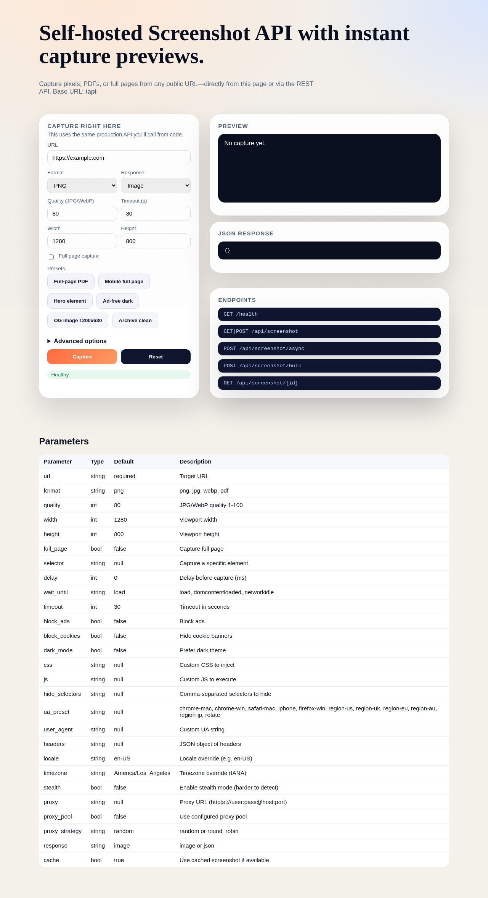

# Captura

Captura is a free, open-source, self-hosted screenshot API inspired by screenshotapi.net. It lets you capture screenshots of any public URL via a simple HTTP API without recurring SaaS fees.



*Captura captured itself.*


## Highlights

- Sync, async, and bulk screenshot capture
- PNG, JPG, WebP, and PDF output
- Full-page, viewport, or element capture
- Custom CSS/JS injection, cookie banner hiding, ad blocking
- Built-in caching and webhook notifications
- Stealth mode, proxy support, and region-aware identity presets

## Quick start

Prerequisites: Docker + Docker Compose.

```bash
docker compose build
docker compose up -d

docker compose run --rm app php artisan migrate
```

Open the docs page:
- http://localhost/
- http://localhost/docs

## API endpoints

- `GET /health`
- `GET|POST /api/screenshot`
- `POST /api/screenshot/async`
- `POST /api/screenshot/bulk`
- `GET /api/screenshot/{id}`

## Example usage

```bash
# Sync screenshot (image response)
curl "http://localhost/api/screenshot?url=https://example.com" --output example.png

# JSON response
curl "http://localhost/api/screenshot?url=https://example.com&response=json"

# Async screenshot
curl -X POST http://localhost/api/screenshot/async \
  -H "Content-Type: application/json" \
  -d '{"url":"https://example.com","full_page":true}'

# Bulk screenshot
curl -X POST http://localhost/api/screenshot/bulk \
  -H "Content-Type: application/json" \
  -d '{"items":[{"url":"https://example.com"},{"url":"https://example.com","full_page":true}]}'

# Stealth + rotate identity + US region bundle
curl "http://localhost/api/screenshot?url=https://example.com&stealth=1&ua_preset=rotate&locale=en-US&timezone=America/New_York"

# Proxy pool round robin
curl "http://localhost/api/screenshot?url=https://example.com&proxy_pool=1&proxy_strategy=round_robin"
```

## Parameters

These are valid for `GET /api/screenshot` and `POST /api/screenshot` unless noted.

| Parameter | Type | Default | Description |
| --- | --- | --- | --- |
| `url` | string | required | Target URL |
| `format` | string | `png` | `png`, `jpg`, `webp`, `pdf` |
| `quality` | int | `80` | JPG/WebP quality 1-100 |
| `width` | int | `1280` | Viewport width |
| `height` | int | `800` | Viewport height |
| `full_page` | bool | `false` | Capture full page |
| `selector` | string | `null` | Capture a specific element |
| `delay` | int | `0` | Delay before capture (ms) |
| `wait_until` | string | `load` | `load`, `domcontentloaded`, `networkidle` |
| `timeout` | int | `30` | Timeout in seconds |
| `block_ads` | bool | `false` | Block ads |
| `block_cookies` | bool | `false` | Hide cookie banners |
| `dark_mode` | bool | `false` | Prefer dark theme |
| `css` | string | `null` | Custom CSS to inject |
| `js` | string | `null` | Custom JS to execute |
| `hide_selectors` | string | `null` | Comma-separated selectors to hide |
| `ua_preset` | string | `null` | See Identity presets below |
| `user_agent` | string | `null` | Custom UA string |
| `headers` | string | `null` | JSON object of headers |
| `locale` | string | `en-US` | Locale override (e.g. `en-US`) |
| `timezone` | string | `America/Los_Angeles` | IANA timezone |
| `stealth` | bool | `false` | Enable stealth mode (harder to detect) |
| `proxy` | string | `null` | Proxy URL (http[s]://user:pass@host:port) |
| `proxy_pool` | bool | `false` | Use configured proxy pool |
| `proxy_strategy` | string | `random` | `random` or `round_robin` |
| `response` | string | `image` | `image` or `json` |
| `cache` | bool | `true` | Use cached screenshot if available |
| `webhook_url` | string | `null` | Async + bulk only: webhook to notify |

## Identity presets

Use `ua_preset` to set a realistic UA + headers + locale + timezone bundle. You can also pass `locale`/`timezone` explicitly to override.

- `chrome-mac`, `chrome-win`, `safari-mac`, `iphone`, `firefox-win`
- Region bundles: `region-us`, `region-uk`, `region-eu`, `region-au`, `region-jp`
- `rotate` or `random` to pick one of the configured presets

## Configuration

All configuration is handled via `app/.env`.

Defaults
- `SCREENSHOT_DEFAULT_WIDTH`, `SCREENSHOT_DEFAULT_HEIGHT`, `SCREENSHOT_DEFAULT_FORMAT`, `SCREENSHOT_DEFAULT_QUALITY`
- `SCREENSHOT_DEFAULT_STEALTH`, `SCREENSHOT_DEFAULT_LOCALE`, `SCREENSHOT_DEFAULT_TIMEZONE`
- `SCREENSHOT_DEFAULT_USER_AGENT` (empty by default to match the Chromium UA), `SCREENSHOT_DEFAULT_ACCEPT_LANGUAGE`, `SCREENSHOT_DEFAULT_ACCEPT` (leave empty unless you know you need it)

Limits
- `SCREENSHOT_MAX_WIDTH`, `SCREENSHOT_MAX_HEIGHT`, `SCREENSHOT_TIMEOUT`

Caching
- `SCREENSHOT_CACHE_ENABLED`, `SCREENSHOT_CACHE_TTL`

Storage
- `SCREENSHOT_STORAGE_PATH`, `SCREENSHOT_PUBLIC_URL`

Security
- `SCREENSHOT_RATE_LIMIT`
- `SCREENSHOT_API_KEY`
- `SCREENSHOT_BLOCKED_HOSTS`
- `SCREENSHOT_ALLOW_LOCALHOST`
- `SCREENSHOT_ALLOWED_HOSTS` (comma-separated allowlist; overrides blocklist/private IP checks)

When `SCREENSHOT_ALLOW_LOCALHOST=true`, the validator also allows `localhost`, `127.0.0.1`, `host.docker.internal`, and `nginx` (for self-capture inside Docker).

Queues
- `SCREENSHOT_QUEUE_NAME`, `SCREENSHOT_RESULT_QUEUE`

Proxy pool
- `SCREENSHOT_PROXY_POOL_ENABLED`
- `SCREENSHOT_PROXY_POOL` (comma-separated list)
- `SCREENSHOT_PROXY_STRATEGY` (`random` or `round_robin`)
- `SCREENSHOT_PROXY_CACHE_KEY`

Cleanup
- `SCREENSHOT_CLEANUP_AFTER`

## Notes on stealth and proxies

Some sites aggressively detect automation. Stealth mode and region-aware identity bundles reduce friction, but they are not guaranteed to bypass every detection system. For hard targets, use a residential proxy and align `locale`, `timezone`, and `ua_preset`.

## Services

`docker compose up` starts:
- Nginx (reverse proxy)
- Laravel (API)
- Redis (queues/cache)
- PostgreSQL (database)
- Node screenshot worker (Puppeteer)

## Project structure

- `app/` Laravel application
- `app/screenshot-worker/` Node.js worker (TypeScript + Puppeteer)
- `docker/` Dockerfiles and configs
- `docker-compose.yml` Local stack

## License

MIT
